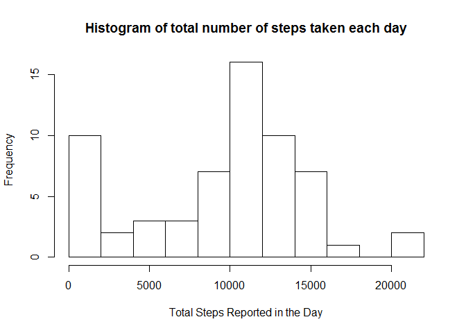
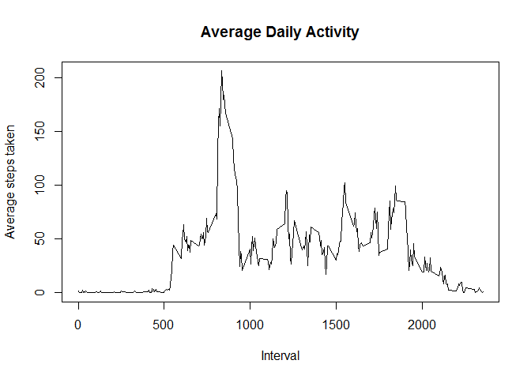
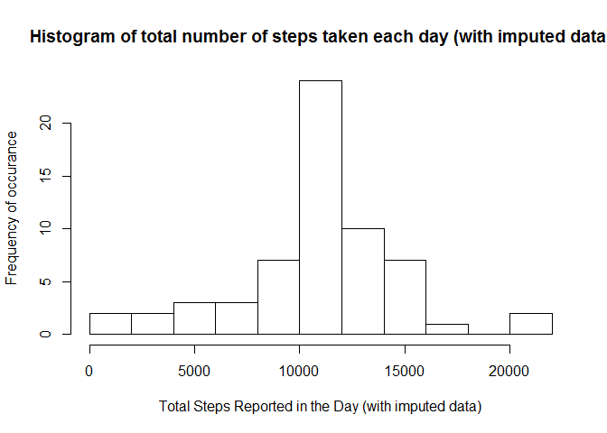
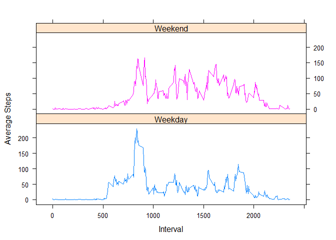

# Reproducible Research: Peer Assessment 1
Jennifer Teed  
October 11, 2015  

This assignment answers a number of questions about the Activity Monitoring Data dataset (included in
the git repository).  Below I document the questions as well as the steps taken to answer them.
Because I used RStudio, the knitr package was built into the environment.

## Loading and preprocessing the data


```r
# save all images to the figures directory
knitr::opts_chunk$set(fig.path='figures/')

# unzip the file
file <- unzip("activity.zip")

# set up the names and data types of the columns and then load the data
df<- read.csv("activity.csv", na.strings="NA", 
             col.names=c("steps", "date", "interval"), 
             colClasses=c("integer", "Date", "integer"))

#used to report the number of observations in the dataset below.
len <- length(df$date)
```

The variables included in this dataset are:

  * steps: Number of steps taking in a 5-minute interval (with missing values are coded as NA )


  * date: The date on which the measurement was taken in YYYY-MM-DD format


  * interval: Identifier for the 5-minute interval in which measurement was taken

The dataset is stored in a comma-separated-value (CSV) file and there are a total of 17568 observations in this dataset.


```r
# take a peek at the data to verify it loaded properly
#head(df)
```

## What is the mean of the total number of steps taken per day?

For this part of the assignment, I ignore the missing values in the dataset.

###1.Calculate the total number of steps taken per day.


```r
# Calculate the number of steps taken, per day, and put the answers into a vector.
v <- aggregate(df[, 1],list(df$date), sum, na.rm=TRUE)
colnames(v) <- c("date", "total.steps")
```
The total number of steps taken per day is in v$total.steps.


###2.Make a histogram of the total number of steps taken each day.


```r
hist(v[ , 2], 
     breaks=10, 
     xlab="Total Steps Reported in the Day", 
     main="Histogram of total number of steps taken each day")
```

 

From this data we can see, that for about half of the days in the reporting period, the person took between ten and fifteen thousand steps per day.


###3.Calculate and report the mean and median of the total number of steps taken per day


```r
# You could use summary here instead to get the answers, but then you can't plug the answers back into the 
# text below. Doing both here to double check answers
summary(v$total.steps)[c(3,4)]
```

```
## Median   Mean 
##  10400   9354
```

```r
meanVal <- signif(mean(v[ , 2]), 4 )
medianVal <- median(v[ , 2])
```


The mean total number steps taken per day is:  *9354*.

The median total number steps taken per day is:  *10395*.

The difference between my computed values and the values reported by summary are due to rounding and/or signifiant digits.


## What is the average daily activity pattern?

###1.Make a time series plot (i.e.  type = "l" ) of the 5-minute interval (x-axis) and the average number of steps taken, averaged across all days (y-axis)


```r
# save the intervals as a unique list, similar to a factor, for later use
# the format of the interval is HHMM, in 5 minute increments, so 100 is 1 hour, 0 minutes
interval.list <- unique(df$interval)

# group the data by interval, then for each interval find the mean number of steps, and plot the results. 
v2 <- aggregate(df$steps, list(df$interval), mean, na.rm=TRUE)
colnames(v2) <- c("interval", "ave.steps")

plot(v2$interval,
     v2$ave.steps,
     type="l", 
     ylab="Average steps taken", 
     xlab="Interval",      
     main="Average Daily Activity")
```

 

###2.Which 5-minute interval, on average across all the days in the dataset, contains the maximum number of steps?


```r
## find the index of the max value of the vector above
index <-  which.max(v2$ave.steps)

## then use the index to identify the interval it occurs in
interval <- interval.list[index]

## the actual maximum value
maxVal<-signif(max(v2$ave.steps), 3)
```


The interval across all days which contains the maximum average number of steps is *835*.

The value of the average number of steps taken during that interval (across all days) is *206*.


## Imputing missing values

There are a number of days/intervals where there are missing values (coded as NA). The presence of missing days may introduce bias into some calculations or summaries of the data.

###1.Calculate and report the total number of missing values in the dataset (i.e. the total number of rows with NAs)

```r
rows.missing.data<-sum(is.na(df))
```
There are 2304 rows with missing values in the dataset.

###2.Devise a strategy for filling in all of the missing values in the dataset. The strategy does not need to be sophisticated. For example, you could use the mean/median for that day, or the mean for that 5-minute interval, etc.

Since I previously calculated the mean for each of the intervals above, I used these values to impute the missing data. More specifically, I computed which rows (indices) of the original dataset contained NAs. Then
created a new column filled with the average associated with the interval for the row.  Finally, for each of the indices of na.indices, replace the steps (NA) with the value in ave.steps.


###3.Create a new dataset that is equal to the original dataset but with the missing data filled in.

```r
#find the indices where steps is NA
#na.indices <-which(is.na(df$steps))

# then, using plyr, add the average steps for the interval as a column to the original data set,
# storing the result in temp
temp<-NULL
library(plyr)
temp <- join(df, v2, by="interval", type="left", match="all")

# go through the vector and if $steps is.NA, replace it with $ave.steps
temp <- mutate(temp, steps = ifelse(is.na(temp$steps), temp$ave.steps, temp$steps))

#Although R generates a warning with the code below, it's equivalent to the code above.
#This is because the length of both steps and ave.steps are equal and the maximum index in
#na.index (used to decide which indices to replace) is the size of both arrays (thus not going
#beyond the end of any of the buffers.).
 
#length(temp$steps)
#length(temp$ave.steps)
#max(na.indices)
#temp$steps <- replace(temp$steps, na.indices, temp$ave.steps)
```


###4.Make a histogram of the total number of steps taken each day and Calculate and report the mean and median total number of steps taken per day. 

Do these values differ from the estimates from the first part of the assignment? 
What is the impact of imputing missing data on the estimates of the total daily number of steps?


```r
# Calculate the number of steps taken, per day, and put the answers into a vector.
v3 <- aggregate(temp[, 1],list(temp$date), sum)  # na.rm is not needed, there are no more NAs.
colnames(v3) <- c("date", "total.steps")

hist(v3[ , 2], breaks=10, ylab="Frequency of occurance", xlab="Total Steps Reported in the Day (with imputed data)", 
  main="Histogram of total number of steps taken each day (with imputed data)")
```

 

```r
# You could use summary here instead to get the answers, but then you can't plug the answers back into the 
# text below. Doing both here to double check answers
summary(v3$total.steps)[c(3,4)]
```

```
## Median   Mean 
##  10770  10770
```

```r
# don't display results in scientific notation
options(scipen=999)

new.meanVal <- signif(mean(v3[ , 2]), 4)
new.medianVal <- signif(median(v3[ , 2]), 4)

mean.diff <- meanVal - new.meanVal
median.diff <- medianVal - new.medianVal
```

Mean:

The mean total number steps taken per day is:  *10770*.

The difference between this value (computed with imputed data) and the original (with NAs removed) is: *-1416*.

Median:

The median total number steps taken per day is:  *10770*.

The difference between this value (computed with imputed data) and the original (with NAs removed) is: *-375*.

This shows that imputing the data increases the average and median number of steps results.  Using this data in further calculations is more reasonable than using zeros as the data for the NA time periods, as it is  more likely the device was turned off than that the person did not take any steps during those times.


## Are there differences in activity patterns between weekdays and weekends?
The dataset with the filled-in missing values is used for this part.

###1.Create a new factor variable in the dataset with two levels, weekday and weekend, ?? indicating whether a given date is a weekday or weekend day.


```r
#Continue to use x, with the imputed values.
temp$day<- weekdays(temp$date)

# create a factor of weekday (m-f) and weekend (s-s)
weekdays.idx <- which(!(temp$day == "Saturday" | temp$day == "Sunday"))
weekends.idx <- which(temp$day == "Saturday" | temp$day == "Sunday")

temp[weekdays.idx, 5] <- "Weekday"
temp[weekends.idx, 5] <- "Weekend"

weekday.data <- temp[ temp$day == "Weekday", ]
weekend.data <- temp[ temp$day == "Weekend", ]

# Convert day to a factor, and show that it worked.
temp$day <- as.factor(temp$day)
is.day.factor <- is.factor(temp$day)
day.levels <- levels(temp$day)
```

The statement, "The day variable in the dataset is a factor." is TRUE.
The levels for the variable are Weekday, Weekend.


###2.Make a panel plot containing a time series plot (i.e. type = "l") of the 5-minute interval (x-axis) and the average number of steps taken, averaged across all weekday days or weekend days (y-axis). See the README file in the GitHub repository to see an example of what this plot should look like using simulated data.


```r
temp$ave.steps <- NULL

library(dplyr)
```

```
## 
## Attaching package: 'dplyr'
## 
## The following objects are masked from 'package:plyr':
## 
##     arrange, count, desc, failwith, id, mutate, rename, summarise,
##     summarize
## 
## The following object is masked from 'package:stats':
## 
##     filter
## 
## The following objects are masked from 'package:base':
## 
##     intersect, setdiff, setequal, union
```

```r
# calculate the NEW mean steps per interval (per day), based on the updated data, 
temp<-ddply(temp, .(interval, day), mutate, ave.steps = mean(steps))

# and plot the data frame as steps per interval grouped by day in a lattice
library(lattice)
myplot <-xyplot(ave.steps ~ interval | day, 
                groups=day, 
                data = temp, 
                type="l", 
                xlab="Interval",
                ylab="Average Steps",
                layout=c(1, 2) )
print(myplot)
```

 

With these plots we can see several things.  First, the early daylight hours are, on average, the times of most consistent activity whether on the weekend or weekdays.  Secondly, the data shows that on work days activity drops considerably during the day compared to the weekend days where activity seems to be more consistent throughout the day. 


## End of document
